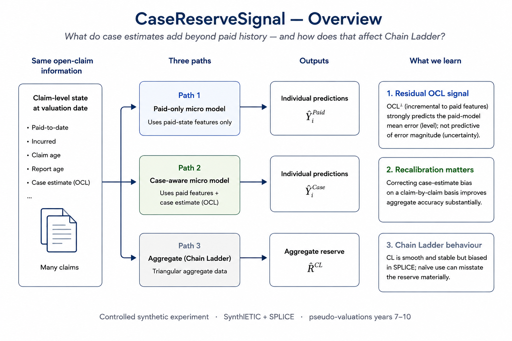

# CaseReserveSignal

What does an individual **case reserve** tell us that paid claims
history does not?

This project studies the divergence between **macro reserving** and
**claim-level reserving** in a controlled synthetic claims environment.
Using transaction histories together with SPLICE incurred histories, it
asks whether the outstanding case liability (**OCL**) contains
predictive information about future **Reported But Not Settled (RBNS)**
cost --- and what happens when that information is aggregated, used
naively, or recalibrated.

The central result is deliberately narrower than "micro beats macro":
**case estimates contain material incremental information about the
level of future RBNS beyond the paid-state variables used here, but
their raw monetary level is badly miscalibrated.**

## Headline findings

-   At the year-10 valuation, raw OCL is about **40% below** hidden
    future RBNS in aggregate, yet it ranks claims well: Spearman
    correlation with future RBNS is about **0.60**, versus about
    **0.16** for paid-to-date.
-   Naive use of case estimates does not solve reserving. On the common
    years 7--10 window, **incurred Chain Ladder is the weakest
    benchmark** in this particular under-reserving regime because it
    inherits the case-reserving bias.
-   A case-aware claim-level model with **Duan smearing** achieves
    **9.4% total-reserve MAPE** on the four common pseudo-valuations,
    versus **13.2% for paid Chain Ladder**. This is descriptive evidence
    from one correlated synthetic portfolio, not an inferential
    comparison.
-   On RBNS alone, the case-aware model has **9.2% MAPE**, versus
    **19.3%** for the paid-only micro benchmark. Its near-zero mean bias
    is partly cancellation: annual errors range from **−12.6% to
    +18.2%**.
-   The final added-variable diagnostic isolates the part of log-OCL not
    explained by paid-to-date, claim age and report age. This residual
    signal, **OCL⊥**, retains a pooled partial Spearman correlation of
    **0.544** with the date-debiased paid-model error, stable at
    **0.534--0.557** across the four valuation years.
-   The corresponding incremental **uncertainty** channel is weak:
    partial R² for log error magnitude is about **0.001**. The
    experiment supports incremental information about **RBNS level**,
    not a comparable claim about incremental predictability once
    paid-state information is controlled for.

## Why smearing appears here

The case-aware model is fitted on a log scale. Exponentiating a fitted
log conditional mean does **not** generally recover the arithmetic
conditional mean required for a best-estimate reserve:

`E[Y | X] != exp(E[log Y | X])`

because the exponential function is convex. The notebook therefore
studies **Duan's smearing estimator** as a non-parametric
retransformation correction.

That correction matters materially here: the historical global smearing
factors are close to **2.0**. The project also shows why this is not
merely a technical footnote --- a stable global smearing factor can
coexist with unstable conditional calibration across claim states.

## The comparison

The common-window horse race uses pseudo-valuations at years **7, 8, 9
and 10** against hidden simulator truth.

  Method                             Mean relative bias        MAPE
  -------------------------------- -------------------- -----------
  Case-aware global smear + IBNR                  −1.2%    **9.4%**
  Paid Chain Ladder                               +3.6%   **13.2%**
  Paid-only micro + IBNR                         −18.3%       18.3%
  Raw OCL + IBNR                                 −36.0%       36.0%
  Incurred Chain Ladder                          −48.2%       48.2%

For the RBNS-based methods, the same causal IBNR estimate is added to
reach the total-reserve target. The cleanest information comparison
therefore remains the **RBNS-only decomposition** rather than treating
the total-reserve table as independent evidence.

## The information question

The final diagnostic asks a stricter question than a raw OCL
correlation:

> Does the case estimate add information **conditional on what the
> paid-only model already knows**?

OCL is residualised against the paid-state features, producing **OCL⊥**.
The resulting added-variable relationship is strong and approximately
monotone for signed RBNS error. It is not comparably strong for error
magnitude.

This distinction is important. The project does **not** assign a
numerical "information loss" to aggregation itself, because moving from
claim-level data to a triangle changes both the information set and the
modelling method.

## Experimental discipline

The notebook uses rolling pseudo-valuations and strict **as-of-T**
information control. Future payments, future case-estimate revisions and
closure information are excluded from predictors at each valuation cut.

The year-10 diagnostics were performed only after reproducing the
published fit exactly. They diagnose the frozen model; they do not
retune it. The final incremental-information section likewise fits no
new reserving model to exploit the observed test outcomes.

That distinction matters because the next scientifically useful step is
**replication on fresh portfolios**, not further optimisation of a book
whose hidden future has already been inspected.

## Future research

The main extension is deliberately left unfitted here:

1.  replicate the complete frozen procedure over independent
    SynthETIC/SPLICE portfolios;
2.  report the distribution of the case-aware-minus-paid-Chain-Ladder
    performance gap;
3.  vary the case-reserving regime rather than relying on one synthetic
    OCL process;
4.  test a second claims simulator or real historical case-estimate
    snapshots;
5.  only on fresh data, investigate richer conditional-mean or
    distributional claim models.

## Repository

  ----------------------------------------------------------------------------------------------------
  File                                                             Contents
  ---------------------------------------------------------------- -----------------------------------
  `reserving_triangles_v2.8.0.ipynb`   Full computational notebook and
                                                                   diagnostics

  `technical_note.pdf`                                             Technical note: motivation,
                                                                   methods, results, glossary and
                                                                   references

  `Images/case_reserve_signal.png`                                 Repository overview figure
  ----------------------------------------------------------------------------------------------------

## Stack

Python · NumPy · pandas · SciPy · scikit-learn · matplotlib ·
chainladder

## Data

The experiment uses **synthetic claims data**: transaction histories
generated with SynthETIC and incurred/case-estimate histories from
SPLICE. The repository should document the exact local inputs required
by the notebook; synthetic source data need not be redistributed if
licensing or file-size considerations make that undesirable.

## Status

Research / experimental. The current evidence comes from **one synthetic
portfolio observed at four correlated valuation dates**. The procedure
is now frozen for replication.

*Idem mutatus resurgo.*
